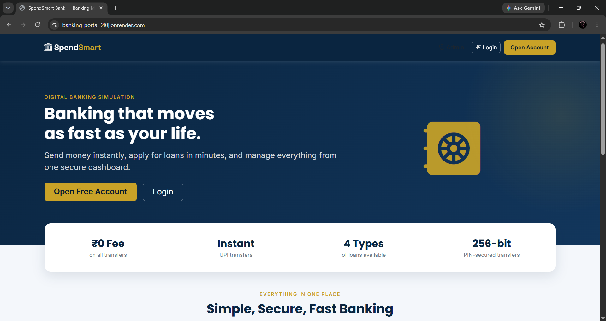
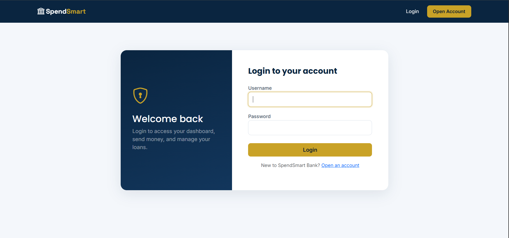
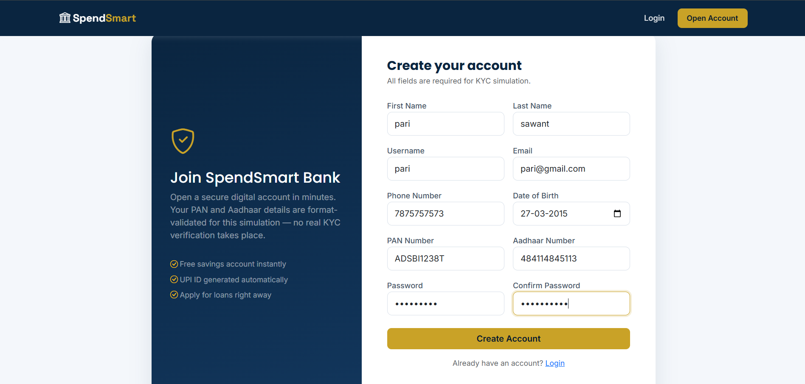
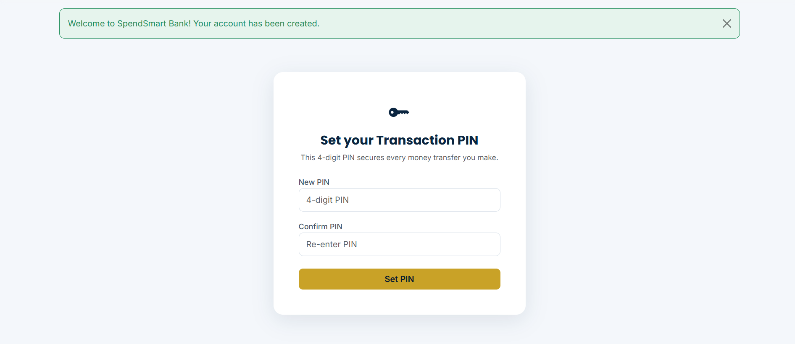
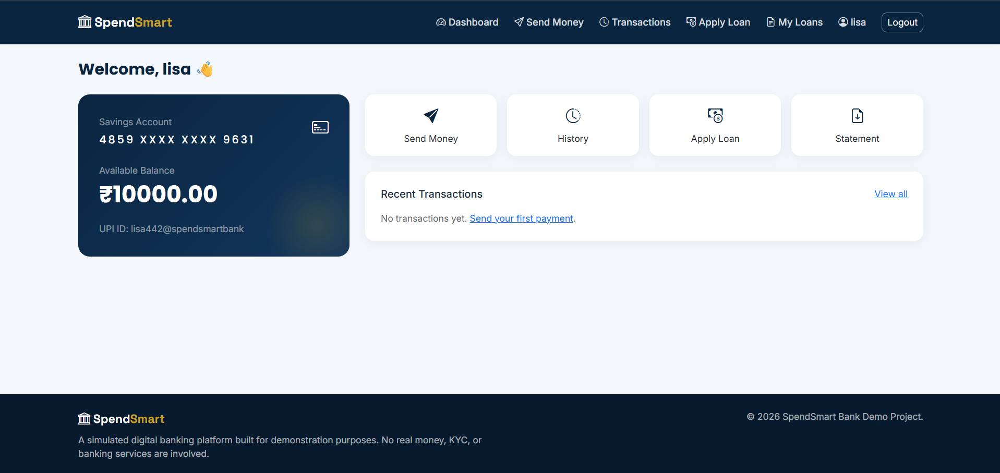
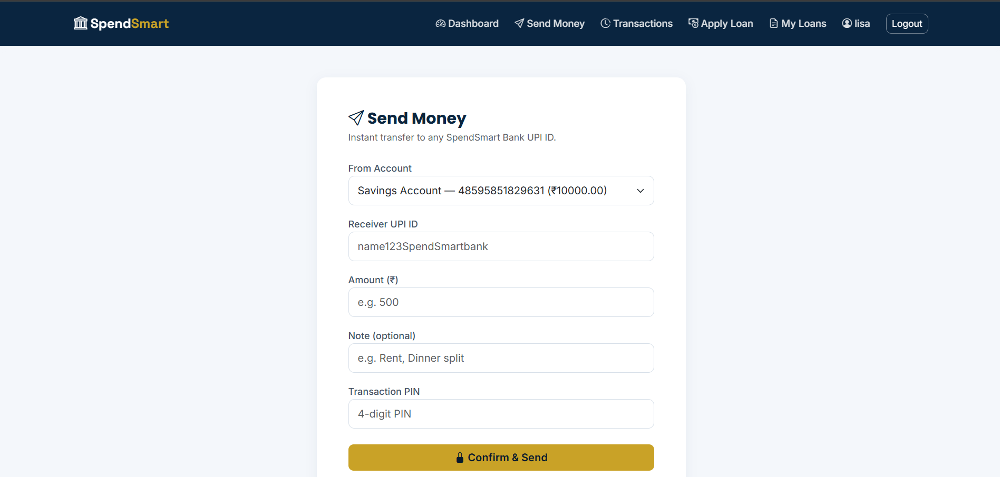
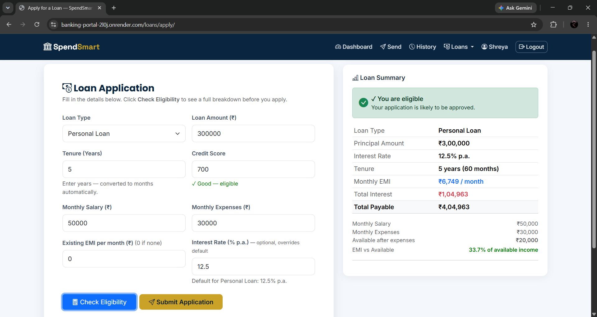
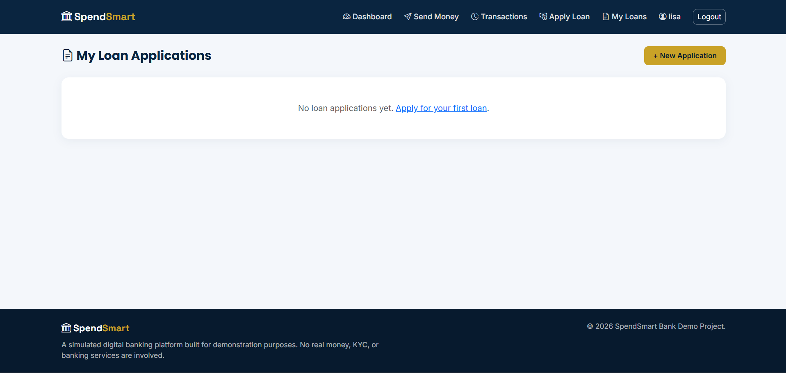
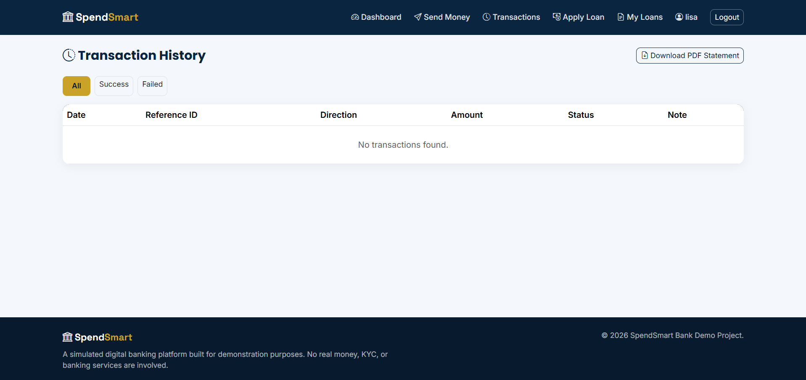

# SpendSmart Bank — Digital Banking Suite

A full-stack simulated digital banking platform built with **Django, SQLite, and Bootstrap 5**, combining a **UPI-style payments module** and a **loan eligibility & management module** under one bank-themed website.

Built as a portfolio project to demonstrate backend, database, and business-logic skills relevant to fintech/banking software roles.

> ⚠️ **This is a simulation.** No real money, banks, or KYC providers are involved. PAN/Aadhaar fields are validated by format (regex) only.

---
🌐 Live Demo

Live Application: https://banking-portal-2l0j.onrender.com

Hosting Platform: Render (Free Tier)

----

## 📸 Screenshots

### Landing Page


### Login


### Create Account (Simulated KYC)


### Set Transaction PIN


### Dashboard


### Send Money (UPI Transfer)


### Loan Application & Eligibility Check


### My Loan Applications


### Transaction History


---

## Features

### 💳 UPI Payments Module
- Auto-generated bank account + UPI ID on signup
- Send/receive money between accounts, protected by a 4-digit transaction PIN
- **Atomic, race-condition-safe transfers** using `transaction.atomic()` + `select_for_update()`
- Daily transfer limit enforcement
- Full transaction history with status filters (Success/Failed)
- Every failed attempt is logged too — a real audit trail, not just successes
- Downloadable PDF account statement (via `reportlab`)

### 🏦 Loan Eligibility Module
**Supported loan types:** Personal · Home · Car · Education
 
**Application captures:** Monthly salary, monthly expenses, credit score, loan amount, and tenure.
 
**System calculates:**
- Interest rate based on loan type
- Monthly EMI using the reducing-balance formula (based on salary, expenses, credit score, and interest rate)
- Eligibility decision with a human-readable reason
- Full month-by-month amortization schedule
### 🎨 General
- Bank-themed responsive UI (navy + gold palette) built with Bootstrap 5
- Custom user model with simulated KYC fields
- Django Admin customized for "bank operations" use
- Unit tests covering EMI/DTI math and transfer edge cases

---

## Tech Stack

| Layer | Technology |
|---|---|
| Backend | Django 6 |
| Database | SQLite (dev) |
| Frontend | Django Templates + Bootstrap 5 + Bootstrap Icons |
| PDF generation | ReportLab |
| Static files | WhiteNoise |
| Deployment | Render (free tier) + Gunicorn |

---

## Local Setup

```bash
git clone <your-repo-url>
cd banksuite

python -m venv venv
source venv/bin/activate      # Windows: venv\Scripts\activate

pip install -r requirements.txt

python manage.py migrate
python manage.py createsuperuser   # optional, for /admin/
python manage.py runserver
```

Visit `http://127.0.0.1:8000/`.

---

## Deployment (Render, free tier)

1. Push this repo to GitHub.
2. On [Render](https://render.com), create a **New Web Service** → connect your GitHub repo.
3. Set:
   - **Build Command:** `./build.sh`
   - **Start Command:** `gunicorn banksuite.wsgi:application`
4. Add environment variables (Render dashboard → Environment):
   - `SECRET_KEY` — any long random string
   - `DEBUG` — `False`
   - `ALLOWED_HOSTS` — `<your-app>.onrender.com`
5. Deploy. Render auto-builds on every push to your main branch.

**Note on SQLite persistence:** Render's free web services use an ephemeral filesystem, so `db.sqlite3` resets on redeploy/restart. For a portfolio demo this is usually fine — for a persistent demo, attach Render's free persistent disk, or switch `DATABASES` to Render's free PostgreSQL instance (the model layer is already ORM-based, so this is a config-only change).

---

## Approval Rules (Loan Engine)

A loan is **approved** only if all three hold:
1. **Credit score** — minimum threshold required
2. **Monthly salary & expenses** — disposable income determines affordability
3. **Interest rate** — determined by loan type, directly affects EMI
4. **EMI affordability** — calculated EMI must fall within an affordable range relative to disposable income

Any failing condition is returned as a specific rejection reason.

---

## Future Work

These were scoped out to keep the project focused, but are natural next steps:
- QR code generation for "receive money" (`qrcode` library — no external API needed)
- Two-factor authentication (email OTP)
- Fraud detection: velocity checks, odd-hour flags, anomaly scoring on transactions
- Simple ML-based credit scoring (logistic regression) as an alternative to the rule engine
- Migrating to PostgreSQL + persistent disk for production use

---

## Project Structure

```
banksuite/
├── accounts/       # Custom user model, registration, login, PIN, profile
├── upi/            # Bank accounts, transactions, send money, PDF statement
├── loans/          # Loan applications, EMI/DTI engine, amortization
├── templates/       # Bank-themed HTML (base, landing, accounts/, upi/, loans/)
├── static/css/      # Custom theme (navy + gold banking palette)
├── banksuite/       # Project settings, urls
├── build.sh          # Render build script
├── Procfile           # Gunicorn start command
└── requirements.txt
```

## Running Tests

```bash
python manage.py test

```

## 🚀 Quick Demo Access
You can log into the live deployment instantly using the pre-seeded demo account:
* **Email:** `demo@spendsmart.com`
* **Password:** `DemoPassword123!`

Covers: EMI calculation accuracy,approval/rejection logic, atomic money transfer, insufficient-balance handling, wrong-PIN blocking, and daily-limit enforcement.

*Built for educational, portfolio, and interview demonstration purposes.*
 
*If you found this useful, consider giving it a ⭐ on GitHub!*
